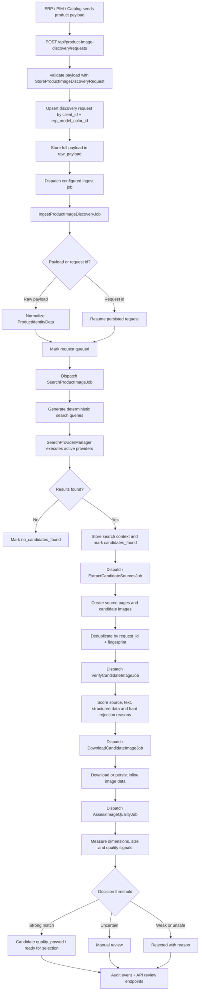

# Product Image Discovery

[](https://packagist.org/packages/padosoft/product-image-discovery)
[](https://www.php.net/)
[](https://laravel.com/)
[](LICENSE)
[](#testing)

Find the right product image, not just any image.

`padosoft/product-image-discovery` is a Laravel package for discovering, verifying, scoring and preparing product images from supplier data, search providers and trusted sources. It is built for catalog teams, ERPs, PIMs and marketplaces where the expensive mistake is not "we found no image"; the expensive mistake is publishing the wrong image for a product-color variant.

The package gives you a conservative pipeline, an API for ingestion and review, database-backed configuration, queue-ready jobs, audit events and an optional Playwright sidecar for pages that need browser rendering.

## Why This Package

- Conservative by design: it optimizes for low false positives.
- Product-color aware: the main identity is `client_id + erp_model_color_id`.
- Explainable decisions: candidates carry source, score, quality and audit context.
- Laravel native: service provider, config, migrations, Eloquent models, form requests, resources, Sanctum-friendly middleware and queue jobs.
- Provider-ready: search providers are configured in the database and resolved through a manager.
- Browser optional: Playwright runs in a separate Node sidecar and is not required for basic usage.
- AI-ready, not AI-dependent: LLM/vision features can be added behind config without making the core fragile.
- Testable offline: the default test suite uses SQLite, fake providers and deterministic sidecar tests.

## What It Does

- Ingests product identity payloads from ERP, PIM or catalog systems.
- Generates targeted search queries from brand, model, SKU, supplier SKU, EAN and color.
- Searches configurable providers.
- Extracts image candidates from search results, structured data, Open Graph tags and gallery-like markup.
- Deduplicates candidates by stable fingerprints.
- Scores candidates against product identity, source trust and image quality.
- Downloads and stores accepted candidate assets.
- Routes uncertain matches to manual review.
- Records audit events for decisions and retries.

## Architecture

The package is split into small layers so you can replace the parts that touch infrastructure:

- **API layer**: `/api/product-image-discovery/...` endpoints for request ingestion, search, candidate review and configuration.
- **Persistence layer**: migrations and Eloquent models for requests, candidates, source pages, settings, trusted sources, providers and audit events.
- **Pipeline layer**: queue jobs for ingest, search, extraction, verification, download and quality assessment.
- **Search layer**: provider definitions, database repository, provider manager and provider factories.
- **Decision layer**: deterministic scoring, anti-false-positive checks and quality thresholds.
- **Sidecar layer**: optional Node service for rendering JavaScript-heavy product pages with Playwright.

## Request Flow



## Installation

### 1. Require the package

```bash
composer require padosoft/product-image-discovery
```

### 2. Publish the config

```bash
php artisan vendor:publish --tag=product-image-discovery-config
```

This creates:

```text
config/product-image-discovery.php
```

### 3. Publish the migrations

```bash
php artisan vendor:publish --tag=product-image-discovery-migrations
```

### 4. Run migrations

```bash
php artisan migrate
```

### 5. Seed default settings and provider templates

```bash
php artisan db:seed --class="Padosoft\\ProductImageDiscovery\\Database\\Seeders\\ProductImageDiscoveryDefaultsSeeder"
```

The seeder creates default matching thresholds, quality settings and disabled provider templates such as Brave, SerpAPI and Google Custom Search.

### 6. Configure Sanctum abilities

The API middleware expects token abilities like:

```text
product-image-discovery:read
product-image-discovery:write
product-image-discovery:review
product-image-discovery:settings
product-image-discovery:admin
```

For a back-office integration, give operators `read` and `review`; give system ingestion tokens `write`; reserve `settings` and `admin` for trusted maintainers.

### 7. Configure queues

By default, jobs use dedicated queue names:

```php
'queues' => [
    'ingest' => 'image-discovery-ingest',
    'search' => 'image-discovery-search',
    'extract' => 'image-discovery-extract',
    'verify' => 'image-discovery-verify',
    'download' => 'image-discovery-download',
    'quality' => 'image-discovery-quality',
],
```

Run your Laravel queue workers as usual:

```bash
php artisan queue:work
```

If you use Horizon, map these queues in `config/horizon.php`.

## Quickstart

Send a product-color payload:

```bash
curl -X POST "https://your-app.test/api/product-image-discovery/requests" \
  -H "Authorization: Bearer YOUR_TOKEN" \
  -H "Accept: application/json" \
  -H "Content-Type: application/json" \
  -d '{
    "client_id": 10,
    "erp_model_color_id": "SHOE-123-BLACK",
    "erp_model_id": "SHOE-123",
    "brand": "Example Brand",
    "supplier": "Main Supplier",
    "sku": "SHOE-123-BLK-42",
    "supplier_sku": "SUP-9988",
    "model_code": "SHOE-123",
    "color_code": "BLK",
    "color_name": "Black",
    "ean": "8050000000000",
    "season": "FW26",
    "category": "Sneakers",
    "material": "Leather"
  }'
```

Example response:

```json
{
  "ok": true,
  "request_id": 1,
  "erp_model_color_id": "SHOE-123-BLACK",
  "status": "queued"
}
```

Search requests:

```bash
curl "https://your-app.test/api/product-image-discovery/requests/search?status=manual_review" \
  -H "Authorization: Bearer YOUR_TOKEN" \
  -H "Accept: application/json"
```

Approve a candidate:

```bash
curl -X POST "https://your-app.test/api/product-image-discovery/requests/1/candidates/5/approve" \
  -H "Authorization: Bearer YOUR_TOKEN" \
  -H "Accept: application/json"
```

Reject a candidate:

```bash
curl -X POST "https://your-app.test/api/product-image-discovery/requests/1/candidates/5/reject" \
  -H "Authorization: Bearer YOUR_TOKEN" \
  -H "Accept: application/json" \
  -H "Content-Type: application/json" \
  -d '{"reason": "wrong_color", "notes": "The image shows the white variant."}'
```

## Configuration

The main config file is `config/product-image-discovery.php`.

Important options:

- `route_prefix`: default `api/product-image-discovery`.
- `route_middleware`: default `['api', 'auth:sanctum']`.
- `abilities`: Sanctum ability names used by the package middleware.
- `models`: override Eloquent models if your app extends package models.
- `jobs.ingest`: override the entry job if you need custom orchestration.
- `queues`: queue names per pipeline phase.
- `storage.disk`: disk used for candidate assets.
- `defaults`: search, quality and decision thresholds.

## Search Providers

Search providers are stored in `product_image_search_providers`.

The package includes:

- `fake`: deterministic test provider.
- `brave`: Brave Search provider implementation.
- Provider templates for SerpAPI and Google Custom Search, ready to be implemented/enabled.

Provider configs are redacted in audit logs. Store secrets in config/env where possible, and never expose API keys through user-facing endpoints.

## Trusted Sources

Trusted source records let you prefer domains that are known to publish correct product images for a client or brand. A trusted source should improve confidence, but it should not bypass hard checks such as wrong color, wrong model, placeholder image or low-quality asset.

## Optional Playwright Sidecar

Some ecommerce pages render images only after JavaScript runs. The package keeps browser rendering out of PHP and delegates it to an optional Node sidecar.

Start the sidecar:

```bash
cd sidecar
npm install
npm start
```

Sidecar endpoints:

- `GET /health`
- `POST /render`

Environment variables:

```text
SIDECAR_HOST=127.0.0.1
SIDECAR_PORT=3100
SIDECAR_SHARED_SECRET=change-me
SIDECAR_DEFAULT_TIMEOUT_MS=15000
SIDECAR_MAX_TIMEOUT_MS=30000
```

The sidecar uses Playwright when available and falls back to static HTTP+HTML extraction when browser rendering is unavailable.

## AI And Vision

The package is designed to support AI-assisted verification, enhancement and description generation, but the core pipeline does not require an LLM. Keep AI features behind configuration flags and run live provider tests only when credentials are explicitly available.

This keeps local development, CI and production ingestion stable even when a model provider is unavailable.

## Testing

Install PHP dependencies:

```bash
composer install
```

Run all PHP suites:

```bash
vendor/bin/phpunit --testsuite Unit,Feature,E2E
```

Run sidecar tests:

```bash
cd sidecar
npm test
```

The current local verification used Herd PHP 8.4:

```powershell
& 'C:\Users\lopad\.config\herd\bin\php84\php.exe' vendor\bin\phpunit --testsuite Unit,Feature,E2E
```

Latest verified result:

```text
48 tests, 213 assertions, 1 skipped
```

The skipped test is an opt-in live sidecar contract test. Set `SIDECAR_E2E_URL` when you want to test against a real running sidecar.

## Database Tables

- `product_image_discovery_requests`
- `product_image_discovery_candidates`
- `product_image_discovery_source_pages`
- `product_image_discovery_settings`
- `product_image_trusted_sources`
- `product_image_search_providers`
- `product_image_discovery_events`

## Safety Notes

- Respect robots.txt and source terms.
- Prefer official supplier, brand or trusted retailer sources.
- Do not publish images when license, ownership or product correctness is unclear.
- Keep manual review in the flow for uncertain matches.
- Treat watermarks, text overlays, placeholders and low-resolution images as quality risks.

## Roadmap

- First-party SerpAPI and Google Custom Search drivers.
- Optional live LLM/vision verification provider contracts.
- Richer duplicate detection through perceptual hashing.
- Image enhancement pipeline behind explicit config.
- Admin UI starter kit for review teams.
- GitHub Actions workflow for PHP, Node and static analysis.

## Contributing

Pull requests are welcome. Before opening one:

1. Keep changes focused.
2. Add or update tests for behavior changes.
3. Run the PHP suite.
4. Run the sidecar suite if you touched `sidecar/`.
5. Update docs when behavior, configuration or architecture changes.

## License

Apache-2.0. See [LICENSE](LICENSE).
