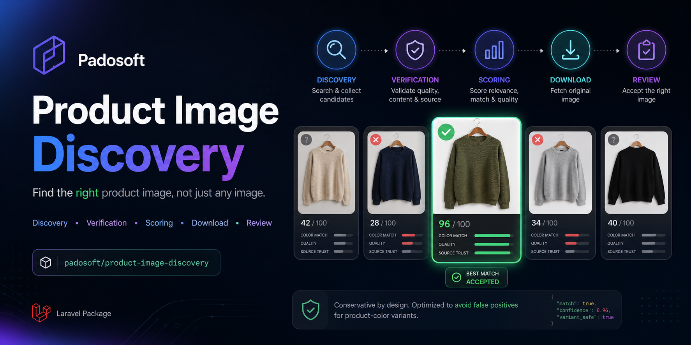
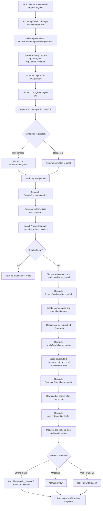
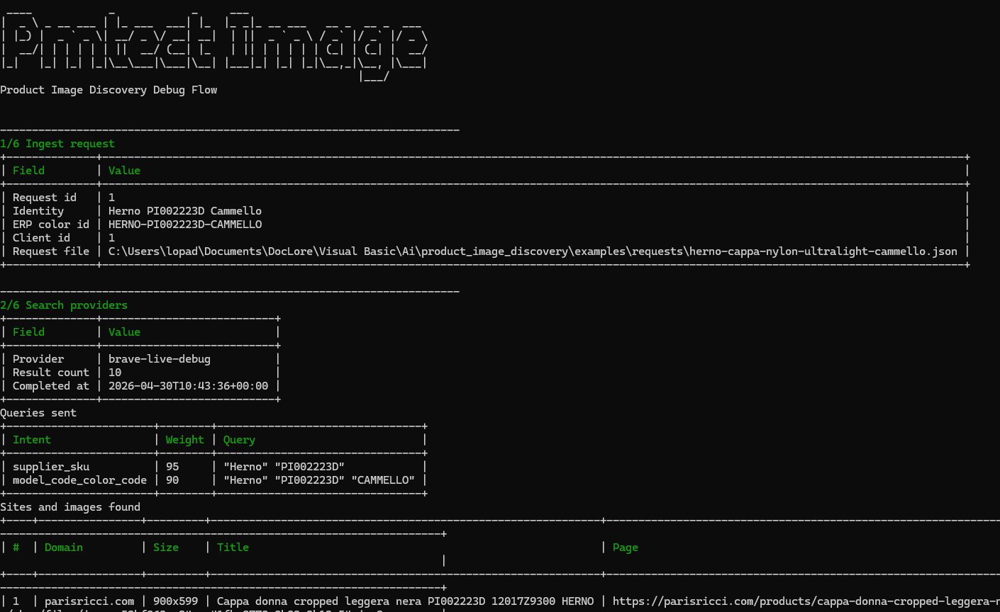
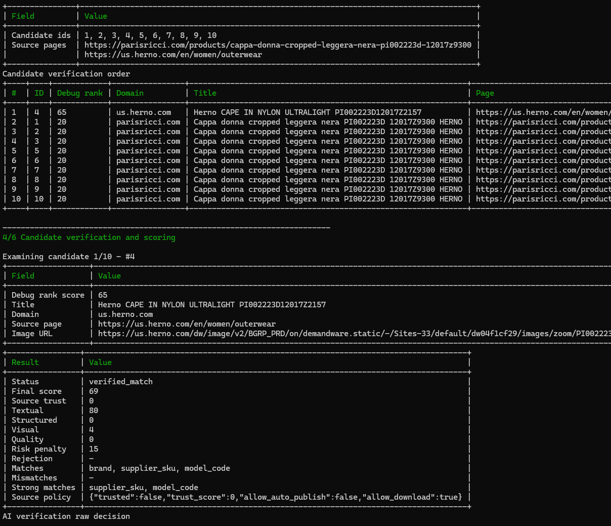

# Product Image Discovery

[](https://packagist.org/packages/padosoft/product-image-discovery)
[](https://www.php.net/)
[](https://laravel.com/)
[](LICENSE)
[](#testing)



Find the right product image, not just any image.

`padosoft/product-image-discovery` is a Laravel package for discovering, verifying, scoring and preparing product images from supplier data, search providers and trusted sources. It is built for catalog teams, ERPs, PIMs and marketplaces where the expensive mistake is not "we found no image"; the expensive mistake is publishing the wrong image for a product-color variant.

The package gives you a conservative pipeline, an API for ingestion and review, database-backed configuration, queue-ready jobs, audit events and an optional Playwright sidecar for pages that need browser rendering.

## Why This Package

- Conservative by design: it optimizes for low false positives.
- Product-color aware: the main identity is `client_id + erp_model_color_id`.
- Explainable decisions: candidates carry source, score, quality and audit context.
- Laravel native: service provider, config, migrations, Eloquent models, form requests, resources, Sanctum-friendly middleware and queue jobs.
- Provider-ready: search providers are configured in the database and resolved through a manager.
- Browser optional: Playwright runs in a separate Node sidecar and is not required for basic usage.
- AI-assisted, not AI-dependent: optional LLM/vision verification can enrich decisions without making the core fragile.
- Testable offline: the default test suite uses SQLite, fake providers and deterministic sidecar tests.

## What It Does

- Ingests product identity payloads from ERP, PIM or catalog systems.
- Generates targeted search queries from brand, model, SKU, supplier SKU, EAN and color.
- Searches configurable providers.
- Extracts image candidates from search results, structured data, Open Graph tags and gallery-like markup.
- Deduplicates candidates by stable fingerprints.
- Scores candidates against product identity, source trust and image quality.
- Downloads and stores accepted candidate assets.
- Routes uncertain matches to manual review.
- Records audit events for decisions and retries.

## Architecture

The package is split into small layers so you can replace the parts that touch infrastructure:

- **API layer**: `/api/product-image-discovery/...` endpoints for request ingestion, search, candidate review and configuration.
- **Persistence layer**: migrations and Eloquent models for requests, candidates, source pages, settings, trusted sources, providers and audit events.
- **Pipeline layer**: queue jobs for ingest, search, extraction, verification, download and quality assessment.
- **Search layer**: provider definitions, database repository, provider manager and provider factories.
- **Decision layer**: deterministic scoring, anti-false-positive checks and quality thresholds.
- **Sidecar layer**: optional Node service for rendering JavaScript-heavy product pages with Playwright.

## Request Flow



## Installation

Requirements:

- PHP 8.3 or newer.
- Laravel 13.
- Composer.
- A database supported by Laravel. SQLite is enough for a local smoke test.
- A queue driver. `sync` is easiest for a first test; Redis/Horizon is better for production.

### 1. Require the package

```bash
composer require padosoft/product-image-discovery
```

If you are testing directly from GitHub before Packagist is updated, add the repository first:

```bash
composer config repositories.product-image-discovery vcs https://github.com/padosoft/product_image_discovery.git
composer require padosoft/product-image-discovery:0.1.0
```

### 2. Review the env examples

The repository ships two examples:

- `.env.example`: useful for a fresh Laravel demo app or for package development.
- `sidecar/.env.example`: useful when running the optional Node/Playwright sidecar.

For a local smoke test, the important host-app values are:

```env
DB_CONNECTION=sqlite
DB_DATABASE=database/database.sqlite
QUEUE_CONNECTION=sync
FILESYSTEM_DISK=local
PRODUCT_IMAGE_DISCOVERY_ROUTE_PREFIX=api/product-image-discovery
PRODUCT_IMAGE_DISCOVERY_STORAGE_DISK=local
PRODUCT_IMAGE_DISCOVERY_DEBUG_STOP_ON_FIRST_GOOD=true
PRODUCT_IMAGE_DISCOVERY_DEBUG_GOOD_SCORE_THRESHOLD=65
```

### 3. Publish the config

```bash
php artisan vendor:publish --tag=product-image-discovery-config
```

This creates:

```text
config/product-image-discovery.php
```

### 4. Publish the migrations

```bash
php artisan vendor:publish --tag=product-image-discovery-migrations
```

### 5. Run migrations

```bash
php artisan migrate
```

### 6. Seed default settings and provider templates

```bash
php artisan db:seed --class="Padosoft\ProductImageDiscovery\Database\Seeders\ProductImageDiscoveryDefaultsSeeder"
```

The seeder creates default matching thresholds, quality settings and disabled provider templates such as Brave, SerpAPI and Google Custom Search.

### 7. Configure Sanctum abilities

The API middleware expects token abilities like:

```text
product-image-discovery:read
product-image-discovery:write
product-image-discovery:review
product-image-discovery:settings
product-image-discovery:admin
```

For a back-office integration, give operators `read` and `review`; give system ingestion tokens `write`; reserve `settings` and `admin` for trusted maintainers.

### 8. Configure queues

By default, jobs use dedicated queue names:

```php
'queues' => [
    'ingest' => 'image-discovery-ingest',
    'search' => 'image-discovery-search',
    'extract' => 'image-discovery-extract',
    'verify' => 'image-discovery-verify',
    'download' => 'image-discovery-download',
    'quality' => 'image-discovery-quality',
],
```

Run your Laravel queue workers as usual:

```bash
php artisan queue:work
```

If you use Horizon, map these queues in `config/horizon.php`.

## Live Smoke Test From A Fresh Laravel App

This path is intentionally explicit so a junior developer can prove the package works in a real Laravel application without setting up Redis, MySQL or a paid search API.

### 1. Create a clean Laravel app

```bash
composer create-project laravel/laravel product-image-discovery-demo "^13.0"
cd product-image-discovery-demo
```

### 2. Install the package from GitHub tag `v0.1.0`

```bash
composer config repositories.product-image-discovery vcs https://github.com/padosoft/product_image_discovery.git
composer require padosoft/product-image-discovery:0.1.0
```

### 3. Configure `.env`

Create the SQLite database file:

```bash
touch database/database.sqlite
```

On Windows PowerShell:

```powershell
New-Item -ItemType File database/database.sqlite -Force
```

Set these values in the Laravel app `.env`:

```env
APP_URL=http://127.0.0.1:8000
DB_CONNECTION=sqlite
DB_DATABASE=database/database.sqlite
QUEUE_CONNECTION=sync
FILESYSTEM_DISK=local
PRODUCT_IMAGE_DISCOVERY_ROUTE_PREFIX=api/product-image-discovery
PRODUCT_IMAGE_DISCOVERY_STORAGE_DISK=local
PRODUCT_IMAGE_DISCOVERY_DEBUG_STOP_ON_FIRST_GOOD=true
PRODUCT_IMAGE_DISCOVERY_DEBUG_GOOD_SCORE_THRESHOLD=65
```

Then generate the app key:

```bash
php artisan key:generate
```

### 4. Install Sanctum tables and enable API tokens

```bash
php artisan vendor:publish --provider="Laravel\Sanctum\SanctumServiceProvider"
```

In `app/Models/User.php`, make sure the model uses Sanctum tokens:

```php
use Laravel\Sanctum\HasApiTokens;

class User extends Authenticatable
{
    use HasApiTokens;
}
```

Keep any existing traits such as `HasFactory` and `Notifiable`; just add `HasApiTokens`.

### 5. Publish package files and migrate

```bash
php artisan vendor:publish --tag=product-image-discovery-config
php artisan vendor:publish --tag=product-image-discovery-migrations
php artisan migrate
php artisan db:seed --class="Padosoft\ProductImageDiscovery\Database\Seeders\ProductImageDiscoveryDefaultsSeeder"
```

### 6. Create a test API token

```bash
php artisan tinker
```

Inside Tinker:

```php
$user = \App\Models\User::factory()->create(['email' => 'pid-demo@example.test']);

$token = $user->createToken('pid-demo', [
    'product-image-discovery:read',
    'product-image-discovery:write',
    'product-image-discovery:review',
    'product-image-discovery:settings',
    'product-image-discovery:admin',
])->plainTextToken;

$token;
```

Copy the printed token for the `Authorization: Bearer ...` header.

### 7. Add a deterministic fake provider

This provider lets you test the whole API and queue path without a paid search API:

```bash
php artisan tinker
```

Inside Tinker:

```php
\Padosoft\ProductImageDiscovery\Models\ProductImageSearchProvider::updateOrCreate(
    ['code' => 'fake-smoke'],
    [
        'name' => 'Fake Smoke Provider',
        'driver' => 'fake',
        'base_url' => 'https://example.test',
        'config' => [
            'supports_image_search' => true,
            'supports_site_filter' => true,
            'image_results' => [[
                'title' => 'Nike Air Force 1 07 White White',
                'page_url' => 'https://www.nike.com/t/air-force-1-07-mens-shoes-jBrhbr',
                'image_url' => 'data:image/jpeg;base64,'.base64_encode(str_repeat('a', 120000)),
                'source_domain' => 'nike.com',
                'width' => 1200,
                'height' => 1200,
                'provider_metadata' => [
                    'inline_image_base64' => base64_encode(str_repeat('a', 120000)),
                    'inline_extension' => 'jpg',
                ],
            ]],
        ],
        'priority' => 1,
        'timeout_seconds' => 10,
        'is_active' => true,
    ],
);
```

### 8. Start the app

```bash
php artisan serve
```

### 9. Send a real API request

Replace `YOUR_TOKEN` with the Sanctum token from step 6:

```bash
curl -X POST "http://127.0.0.1:8000/api/product-image-discovery/requests" \
  -H "Authorization: Bearer YOUR_TOKEN" \
  -H "Accept: application/json" \
  -H "Content-Type: application/json" \
  -d '{
    "client_id": 1,
    "erp_model_id": "NIKE-AF1-07",
    "erp_model_color_id": "NIKE-AF1-07-CW2288-111",
    "brand": "Nike",
    "supplier": "Nike",
    "supplier_sku": "CW2288-111",
    "model_code": "Air Force 1 07",
    "color_code": "CW2288-111",
    "color_name": "White",
    "category": "Sneakers",
    "material": "Leather"
  }'
```

The same payload is available as a ready-to-edit JSON file:

```bash
curl -X POST "http://127.0.0.1:8000/api/product-image-discovery/requests" \
  -H "Authorization: Bearer YOUR_TOKEN" \
  -H "Accept: application/json" \
  -H "Content-Type: application/json" \
  --data @examples/requests/nike-air-force-1-live.json
```

You should receive a JSON response with `ok: true` and a `request_id`. Because `QUEUE_CONNECTION=sync`, the pipeline runs during the request cycle.

Check the stored request:

```bash
curl "http://127.0.0.1:8000/api/product-image-discovery/requests/1" \
  -H "Authorization: Bearer YOUR_TOKEN" \
  -H "Accept: application/json"
```

### 10. Optional: activate Brave for a real external search

Add your key to `.env`:

```env
BRAVE_SEARCH_API_KEY=your-real-key
```

Then activate the seeded Brave provider:

```bash
php artisan tinker
```

Inside Tinker:

```php
$provider = \Padosoft\ProductImageDiscovery\Models\ProductImageSearchProvider::where('code', 'brave')->firstOrFail();
$provider->api_key_encrypted = env('BRAVE_SEARCH_API_KEY');
$provider->is_active = true;
$provider->save();
```

Disable the fake provider when you want only live search results:

```php
\Padosoft\ProductImageDiscovery\Models\ProductImageSearchProvider::where('code', 'fake-smoke')->update(['is_active' => false]);
```

## Debug Flow Command

The package includes a console command for full live debugging from a request JSON file. It runs the same pipeline jobs as the queue flow and streams a step-by-step console trace: ingest, generated queries, sites/images found, candidate verification order, every candidate examined, score components, deterministic evidence, optional AI output, download path, hash, quality analysis, errors and final decision.

Before verification, the command ranks candidates with deterministic scoring, so constrained runs start from the strongest product identity match and avoid spending live AI calls on obvious wrong-color or wrong-model candidates first. Use `--report=...` to keep the complete JSON report on disk; use `--json` when you need machine-readable output instead of the live console trace.

Where to run it:

- Inside a host Laravel app that installed the package, use `php artisan ...`.
- Inside this package repository, there is no `artisan` file. Use Orchestra Testbench through `vendor/bin/testbench`.

What you see on screen:

- ASCII art header, so debug runs are easy to spot in terminal history.
- Request ingest: JSON file path, `client_id`, `erp_model_color_id`, brand, model and color identity.
- Search step: provider used, generated queries, query weights, result count and provider attempts.
- Found sites and images: source domain, page URL, image URL, title and image dimensions for each provider result.
- Extraction step: candidate ids and source pages retained from the search results.
- Candidate plan: deterministic debug rank and the exact order in which candidates will be examined.
- Per-candidate verification: candidate URL, source page, source policy, score components, final score, matches, mismatches, strong matches and rejection reason.
- AI verification output when enabled: provider, model, status, match flags, confidence, brand/model/color/type/quality booleans, AI rejection reason, notes and errors.
- Download step: selected candidate id, remote image URL, local storage path, MIME type, bytes and SHA-256 hash.
- Quality analysis: pass/fail, quality score, dimensions, MIME type and quality issues.
- Final decision: request status, selected/best candidate id, final score, verified match count and report path.
- Audit events: persisted event type, level, candidate id and JSON context for later inspection.

```bash
php artisan product-image-discovery:debug-flow examples/requests/herno-cappa-nylon-ultralight-cammello.json
```

That `php artisan` form only works from a Laravel app root. If you run it from the package root and see `Could not open input file: artisan`, use the Testbench commands in the Herno example below.

Useful options:

```bash
php artisan product-image-discovery:debug-flow examples/requests/herno-cappa-nylon-ultralight-cammello.json \
  --fresh \
  --max-candidates=10 \
  --report=storage/app/product-image-discovery/debug/herno-flow.json
```

- `--fresh`: deletes the existing request for the same `client_id + erp_model_color_id` before running.
- `--max-candidates=10`: limits how many discovered candidates are verified in this debug run.
- `--report=...`: writes the complete JSON report to disk while still printing the formatted console output.
- `--json`: prints only the JSON report and disables the live console trace.
- `--no-download`: skips download and quality assessment.
- `--download-all`: downloads and quality-assesses every verified candidate; by default only the best verified candidate is downloaded.
- `--stop-on-first-good`: stops verifying more candidates after a good verified candidate is found.
- `--exhaustive`: verifies every candidate up to `--max-candidates`, ignoring the early-stop setting.
- `--good-score=65`: overrides the score threshold used by early stop.
- `--migrate`: runs migrations first, useful in local demo/Testbench environments.
- `--no-env-brave`: disables automatic creation of a `brave-live-debug` provider from `BRAVE_SEARCH_API_KEY`.
- `--fail-on-no-match`: exits with a failure code when no candidate reaches `verified_match`.

Early stop is controlled by:

```env
PRODUCT_IMAGE_DISCOVERY_DEBUG_STOP_ON_FIRST_GOOD=true
PRODUCT_IMAGE_DISCOVERY_DEBUG_GOOD_SCORE_THRESHOLD=65
```

With early stop enabled, the command stops candidate verification when a verified candidate is good enough because it comes from an auto-publish/trusted source, the source domain contains the brand, or its final score reaches the configured threshold. Use `--exhaustive` when you intentionally want to inspect all candidates up to `--max-candidates`.

To inspect and download every verified candidate in a broad run, combine:

```bash
php artisan product-image-discovery:debug-flow examples/requests/herno-cappa-nylon-ultralight-cammello.json \
  --exhaustive \
  --download-all \
  --max-candidates=10
```

### Herno Live Debug Example

The repository includes a real fashion request example without any source page or image URL:

```text
examples/requests/herno-cappa-nylon-ultralight-cammello.json
```

It describes:

- Brand: `Herno`
- Model/code: `PI002223D`
- Product: `Cappa In Nylon Ultralight Cammello`
- Color: `Cammello`
- Category: `Donna > Maglie e camicie > Felpe e maglie`
- Material: `100% Nylon`

Run it in a host Laravel app:

```bash
php artisan product-image-discovery:debug-flow examples/requests/herno-cappa-nylon-ultralight-cammello.json \
  --fresh \
  --max-candidates=10 \
  --report=storage/app/product-image-discovery/debug/herno-flow.json
```

Run it from this package with Testbench on Windows PowerShell:

```powershell
$env:APP_KEY = 'base64:' + [Convert]::ToBase64String([Text.Encoding]::ASCII.GetBytes(('a' * 32)))
$env:DB_CONNECTION='sqlite'
$env:DB_DATABASE=':memory:'
$request = (Resolve-Path .\examples\requests\herno-cappa-nylon-ultralight-cammello.json).Path
$report = Join-Path (Get-Location) 'storage\debug\herno-flow.json'
& 'C:\Users\lopad\.config\herd\bin\php84\php.exe' vendor\bin\testbench product-image-discovery:debug-flow $request --migrate --fresh --max-candidates=10 --report=$report
```

Run it from this package with Testbench on macOS/Linux shell:

```bash
export APP_KEY="$(php -r 'echo "base64:".base64_encode(str_repeat("a", 32));')"
export DB_CONNECTION=sqlite
export DB_DATABASE=':memory:'
request="$(pwd)/examples/requests/herno-cappa-nylon-ultralight-cammello.json"
report="$(pwd)/storage/debug/herno-flow.json"
php vendor/bin/testbench product-image-discovery:debug-flow "$request" --migrate --fresh --max-candidates=10 --report="$report"
```

With `BRAVE_SEARCH_API_KEY` configured, the command auto-creates a `brave-live-debug` provider and shows the live Brave image results. With AI enabled and `PRODUCT_IMAGE_DISCOVERY_AI_ATTACH_REMOTE_IMAGE=true`, it also sends each verified candidate image URL to the configured vision model and prints the full AI verification result.

In the local Herno run, the trace found the official `us.herno.com` image, downloaded it under `product-image-discovery/{request_id}/{candidate_id}.jpg`, quality-checked it, printed the SHA-256 hash, and kept the request in `manual_review` because the source was not configured as auto-publishable. External results and AI wording can change, so treat the report as the source of truth for each run.

Console screenshots:





## Quickstart

Send a product-color payload:

```bash
curl -X POST "https://your-app.test/api/product-image-discovery/requests" \
  -H "Authorization: Bearer YOUR_TOKEN" \
  -H "Accept: application/json" \
  -H "Content-Type: application/json" \
  -d '{
    "client_id": 10,
    "erp_model_color_id": "SHOE-123-BLACK",
    "erp_model_id": "SHOE-123",
    "brand": "Example Brand",
    "supplier": "Main Supplier",
    "sku": "SHOE-123-BLK-42",
    "supplier_sku": "SUP-9988",
    "model_code": "SHOE-123",
    "color_code": "BLK",
    "color_name": "Black",
    "ean": "8050000000000",
    "season": "FW26",
    "category": "Sneakers",
    "material": "Leather"
  }'
```

Example response:

```json
{
  "ok": true,
  "request_id": 1,
  "erp_model_color_id": "SHOE-123-BLACK",
  "status": "queued"
}
```

Search requests:

```bash
curl "https://your-app.test/api/product-image-discovery/requests/search?status=manual_review" \
  -H "Authorization: Bearer YOUR_TOKEN" \
  -H "Accept: application/json"
```

Approve a candidate:

```bash
curl -X POST "https://your-app.test/api/product-image-discovery/requests/1/candidates/5/approve" \
  -H "Authorization: Bearer YOUR_TOKEN" \
  -H "Accept: application/json"
```

Reject a candidate:

```bash
curl -X POST "https://your-app.test/api/product-image-discovery/requests/1/candidates/5/reject" \
  -H "Authorization: Bearer YOUR_TOKEN" \
  -H "Accept: application/json" \
  -H "Content-Type: application/json" \
  -d '{"reason": "wrong_color", "notes": "The image shows the white variant."}'
```

## Real Product Payload Examples

These examples are realistic ERP/PIM payloads for products that also exist on public fashion sites. The request intentionally does not include an image URL or product page URL: discovering that page/image is the job of the package. Ecommerce pages can change, go out of stock or block automated access, so treat these as smoke-test payloads rather than permanent fixtures. Do not invent EANs: leave `ean` empty unless your ERP/PIM has the real barcode.

Ready-to-edit request files are available in:

```text
examples/requests/
```

- `erp-product-image-discovery-request.example.json`: generic ERP/PIM template without image/source URLs.
- `nike-air-force-1-live.json`: concrete Nike smoke-test payload.
- `herno-cappa-nylon-ultralight-cammello.json`: concrete Herno fashion payload for live discovery/debug flow testing.

### Nike Air Force 1 07, White/White

Source page: [Nike Air Force 1 07 men's shoes](https://www.nike.com/t/air-force-1-07-mens-shoes-jBrhbr)

```json
{
  "client_id": 1,
  "erp_model_id": "NIKE-AF1-07",
  "erp_model_color_id": "NIKE-AF1-07-CW2288-111",
  "brand": "Nike",
  "supplier": "Nike",
  "supplier_sku": "CW2288-111",
  "model_code": "Air Force 1 07",
  "color_code": "CW2288-111",
  "color_name": "White",
  "category": "Sneakers",
  "material": "Leather"
}
```

### Nike Air Force 1 07, White/White, LuisaViaRoma item

Source page: [LuisaViaRoma Nike Air Force 1 07 sneakers](https://www.luisaviaroma.com/en-us/p/nike/women/82I-U3C014)

```json
{
  "client_id": 1,
  "erp_model_id": "NIKE-AF1-07-WOMEN",
  "erp_model_color_id": "LVR-82I-U3C014",
  "brand": "Nike",
  "supplier": "LuisaViaRoma",
  "supplier_sku": "82I-U3C014",
  "model_code": "Air Force 1 07",
  "color_code": "82I-U3C014",
  "color_name": "White",
  "category": "Sneakers",
  "material": "Calf leather"
}
```

### adidas Originals Samba OG, White/Black, LuisaViaRoma item

Source page: [LuisaViaRoma adidas Originals Samba OG sneakers](https://www.luisaviaroma.com/en-us/p/adidas-originals/men/80I-T57018)

```json
{
  "client_id": 1,
  "erp_model_id": "ADIDAS-SAMBA-OG",
  "erp_model_color_id": "LVR-80I-T57018",
  "brand": "adidas Originals",
  "supplier": "LuisaViaRoma",
  "supplier_sku": "80I-T57018",
  "model_code": "Samba OG",
  "color_code": "80I-T57018",
  "color_name": "White/Black",
  "category": "Sneakers",
  "material": "Calf leather"
}
```

### New Balance 550, White/Grey, LuisaViaRoma item

Source page: [LuisaViaRoma New Balance 550 sneakers](https://www.luisaviaroma.com/en-us/p/new-balance/men/78I-AM9016)

```json
{
  "client_id": 1,
  "erp_model_id": "NEW-BALANCE-550",
  "erp_model_color_id": "LVR-78I-AM9016",
  "brand": "New Balance",
  "supplier": "LuisaViaRoma",
  "supplier_sku": "78I-AM9016",
  "model_code": "550",
  "color_code": "78I-AM9016",
  "color_name": "White/Grey",
  "category": "Sneakers",
  "material": "Leather and synthetic"
}
```

Amazon is not used as a default example because product pages are highly personalized, protected and terms-sensitive. Use official brand pages or trusted fashion retailers first.

## Configuration

The main config file is `config/product-image-discovery.php`.

Important options:

- `route_prefix`: default `api/product-image-discovery`.
- `route_middleware`: default `['api', 'auth:sanctum']`.
- `abilities`: Sanctum ability names used by the package middleware.
- `models`: override Eloquent models if your app extends package models.
- `jobs.ingest`: override the entry job if you need custom orchestration.
- `queues`: queue names per pipeline phase.
- `storage.disk`: disk used for candidate assets.
- `defaults`: search, quality and decision thresholds.

## Search Providers

Search providers are stored in `product_image_search_providers`.

The package includes:

- `fake`: deterministic test provider.
- `brave`: Brave Search provider implementation.
- Provider templates for SerpAPI and Google Custom Search, ready to be implemented/enabled.

Provider configs are redacted in audit logs. Store secrets in config/env where possible, and never expose API keys through user-facing endpoints.

## Trusted Sources

Trusted source records let you prefer domains that are known to publish correct product images for a client or brand. A trusted source should improve confidence, but it should not bypass hard checks such as wrong color, wrong model, placeholder image or low-quality asset.

## Optional Playwright Sidecar

Some ecommerce pages render images only after JavaScript runs. The package keeps browser rendering out of PHP and delegates it to an optional Node sidecar.

Start the sidecar:

```bash
cd sidecar
npm install
npm start
```

Sidecar endpoints:

- `GET /health`
- `POST /render`

Environment variables:

```text
SIDECAR_HOST=127.0.0.1
SIDECAR_PORT=3100
SIDECAR_SHARED_SECRET=change-me
SIDECAR_DEFAULT_TIMEOUT_MS=15000
SIDECAR_MAX_TIMEOUT_MS=30000
```

The sidecar uses Playwright when available and falls back to static HTTP+HTML extraction when browser rendering is unavailable.

## AI And Vision

The package includes an optional Laravel AI SDK integration for AI-assisted candidate verification. The core pipeline does not require an LLM: deterministic source/text/quality checks still run first, and AI output is stored as supporting evidence in `ai_analysis`.

This keeps local development, CI and production ingestion stable even when a model provider is unavailable.

The config supports OpenAI, Anthropic and OpenRouter:

```env
PRODUCT_IMAGE_DISCOVERY_AI_ENABLED=false
PRODUCT_IMAGE_DISCOVERY_AI_PROVIDER=anthropic
PRODUCT_IMAGE_DISCOVERY_AI_TIMEOUT=45
PRODUCT_IMAGE_DISCOVERY_AI_FAIL_SILENTLY=true
PRODUCT_IMAGE_DISCOVERY_AI_ATTACH_REMOTE_IMAGE=false
PRODUCT_IMAGE_DISCOVERY_AI_VISION_MODEL=claude-sonnet-4-5-20250929
PRODUCT_IMAGE_DISCOVERY_AI_DESCRIPTION_MODEL=claude-haiku-4-5-20251001
OPENAI_API_KEY=
OPENAI_URL=https://api.openai.com/v1
OPENAI_BASE_URL=
ANTHROPIC_API_KEY=
ANTHROPIC_URL=https://api.anthropic.com/v1
ANTHROPIC_BASE_URL=
OPENROUTER_API_KEY=
OPENROUTER_URL=https://openrouter.ai/api/v1
OPENROUTER_BASE_URL=
```

To enable AI verification:

```env
PRODUCT_IMAGE_DISCOVERY_AI_ENABLED=true
PRODUCT_IMAGE_DISCOVERY_AI_PROVIDER=anthropic
ANTHROPIC_API_KEY=your-key
```

For OpenRouter:

```env
PRODUCT_IMAGE_DISCOVERY_AI_ENABLED=true
PRODUCT_IMAGE_DISCOVERY_AI_PROVIDER=openrouter
OPENROUTER_API_KEY=your-key
OPENROUTER_URL=https://openrouter.ai/api/v1
PRODUCT_IMAGE_DISCOVERY_AI_VISION_MODEL=your-openrouter-vision-model-id
```

By default, remote image attachments are disabled and the verifier sends product/candidate metadata only. Set `PRODUCT_IMAGE_DISCOVERY_AI_ATTACH_REMOTE_IMAGE=true` when you want the selected provider/model to inspect the candidate image URL directly. Keep this opt-in because not every provider/model supports remote image attachments.

For Anthropic, `PRODUCT_IMAGE_DISCOVERY_AI_VISION_MODEL=claude-sonnet-4-5-20250929` is a strong default for visual/product verification, while `PRODUCT_IMAGE_DISCOVERY_AI_DESCRIPTION_MODEL=claude-haiku-4-5-20251001` is a lower-cost default for description-style support tasks. If you switch to OpenAI or OpenRouter, set model names supported by that provider.

## Testing

Install PHP dependencies:

```bash
composer install
```

Run all PHP suites:

```bash
vendor/bin/phpunit --testsuite Unit,Feature,E2E
```

Run sidecar tests:

```bash
cd sidecar
npm test
```

The current local verification used Herd PHP 8.4:

```powershell
& 'C:\Users\lopad\.config\herd\bin\php84\php.exe' vendor\bin\phpunit --testsuite Unit,Feature,E2E
```

In a fresh offline environment, live sidecar/search/AI checks are skipped cleanly unless their credentials or URLs are provided. The current local verification with real `BRAVE_SEARCH_API_KEY`, real `ANTHROPIC_API_KEY` and remote AI image attachments enabled is:

```text
60 tests, 276 assertions, 1 skipped
```

The skipped test is the live sidecar contract. Set `SIDECAR_E2E_URL` to test against a real running sidecar. Live search and AI checks require their provider credentials.

Run the live AI verifier explicitly when you have a real Anthropic, OpenRouter or OpenAI key in `.env`:

```powershell
& 'C:\Users\lopad\.config\herd\bin\php84\php.exe' vendor\bin\phpunit --testsuite E2E --filter LiveProductImageAiVerifierTest
```

With `PRODUCT_IMAGE_DISCOVERY_AI_ATTACH_REMOTE_IMAGE=true`, this live test sends a real product image URL to the provider and should pass with `1 test`, `9 assertions`.

## Database Tables

- `product_image_discovery_requests`
- `product_image_discovery_candidates`
- `product_image_discovery_source_pages`
- `product_image_discovery_settings`
- `product_image_trusted_sources`
- `product_image_search_providers`
- `product_image_discovery_events`

## Safety Notes

- Respect robots.txt and source terms.
- Prefer official supplier, brand or trusted retailer sources.
- Do not publish images when license, ownership or product correctness is unclear.
- Keep manual review in the flow for uncertain matches.
- Treat watermarks, text overlays, placeholders and low-resolution images as quality risks.

## Roadmap

- First-party SerpAPI and Google Custom Search drivers.
- Richer AI review signals while keeping deterministic checks as the publication gate.
- Richer duplicate detection through perceptual hashing.
- Image enhancement pipeline behind explicit config.
- Admin UI starter kit for review teams.
- GitHub Actions workflow for PHP, Node and static analysis.

## Contributing

Pull requests are welcome. Before opening one:

1. Keep changes focused.
2. Add or update tests for behavior changes.
3. Run the PHP suite.
4. Run the sidecar suite if you touched `sidecar/`.
5. Update docs when behavior, configuration or architecture changes.

## License

Apache-2.0. See [LICENSE](LICENSE).
