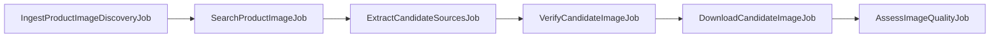

# Components

## Source Map

| Path | Responsibility |
| --- | --- |
| `src/Actions` | Pure workflow decisions and scoring steps. |
| `src/Jobs` | Queueable pipeline stages. |
| `src/Models` | Eloquent persistence for requests, candidates, settings, providers, sources, and events. |
| `src/Http/Controllers/Api` | API endpoints for ingestion and review surfaces. |
| `src/Http/Requests` | Validation for inbound API data. |
| `src/Http/Resources` | API response serialization. |
| `src/Services` | AI, extraction, logging, quality, storage, and support services. |
| `src/Console/Commands` | Debug and operational CLI entry points. |

## Job Chain

