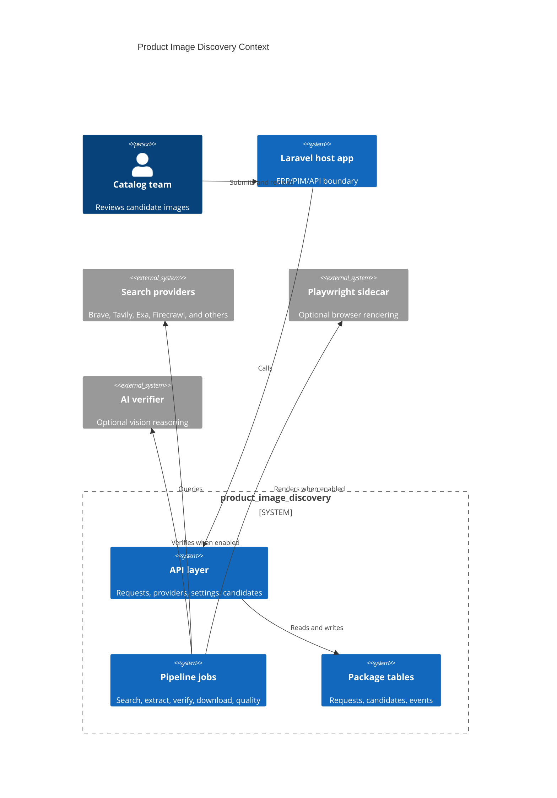

# Architecture Overview

`product_image_discovery` is a Laravel package that plugs into a host app. It does not own the host catalog; it receives product identity, produces candidate image evidence, and exposes reviewable state.

## Boundaries

| Boundary | Owned by package | Owned by host app |
| --- | --- | --- |
| API resources | Yes | Auth policy and routing context |
| Queue jobs | Yes | Worker infrastructure |
| Storage | Writes via Laravel filesystem | Disk selection and retention |
| Publishing decision | Candidate state | Final catalog publication |
