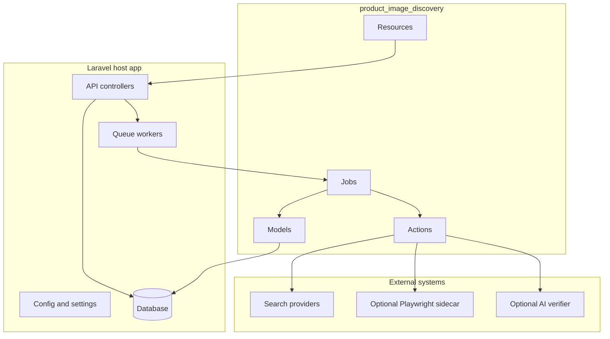

# Design

The package separates ingestion, provider querying, candidate extraction, verification, download, quality analysis, and review.

## Principles

::: steps
1. Keep provider configuration data-backed.
2. Keep browser rendering outside PHP.
3. Keep AI optional and explainable.
4. Keep every decision auditable.
5. Prefer manual review over unsafe automatic acceptance.
:::
