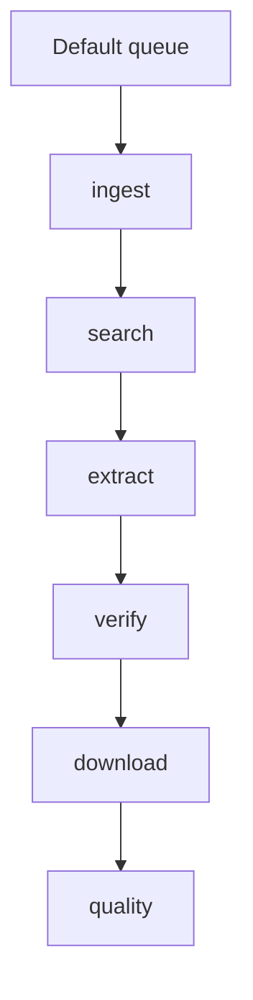

# Configuration

The published `config/product-image-discovery.php` controls route wiring, queue names, storage, scoring, AI verification, provider behavior, and sidecar access.

::: tabs
::: tab Local
```env
QUEUE_CONNECTION=sync
PRODUCT_IMAGE_DISCOVERY_ROUTE_PREFIX=api/product-image-discovery
PRODUCT_IMAGE_DISCOVERY_AI_ENABLED=false
```
:::
::: tab Production
```env
QUEUE_CONNECTION=redis
PRODUCT_IMAGE_DISCOVERY_ROUTE_PREFIX=api/product-image-discovery
PRODUCT_IMAGE_DISCOVERY_AI_ENABLED=true
PRODUCT_IMAGE_DISCOVERY_SIDECAR_ENABLED=true
```
:::
:::

## Configuration Sources

Configuration is split deliberately:

| Source | Use |
| --- | --- |
| Laravel config file | Stable package defaults and infrastructure wiring. |
| Database settings | Runtime-tunable thresholds and behavior. |
| Search provider rows | Provider credentials, driver names, priority, timeout, and active state. |
| Trusted source rows | Domains, URL patterns, and source preferences. |

## Queue Names

Pipeline jobs use queue resolution helpers so deployments can isolate product image work from interactive web requests.



## Practical Baseline

::: steps
1. Start with one deterministic fake provider.
2. Add one real image-search provider.
3. Add trusted supplier or brand domains.
4. Run the debug flow against known products.
5. Tune thresholds only after collecting accepted and rejected examples.
:::
