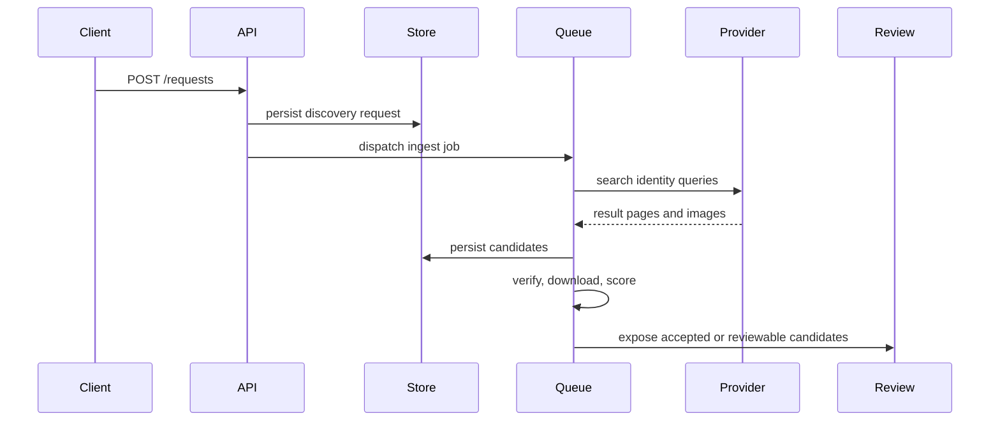

# Pipeline Workflow

The pipeline is intentionally conservative. Each stage adds evidence or rejects unsafe candidates.

## Stages

| Stage | Responsibility | Failure posture |
| --- | --- | --- |
| Ingest | Normalize product identity and create request state. | Reject invalid payloads early. |
| Search | Query active providers using brand, model, color, EAN, and trusted hints. | Continue with other providers. |
| Extract | Resolve candidate source pages and structured image data. | Keep provenance for audit. |
| Verify | Compare candidate evidence against identity. | Prefer review over automatic accept. |
| Download | Persist candidate image bytes and metadata. | Reject broken or unsafe downloads. |
| Quality | Score resolution, aspect, and usable image traits. | Reject low-quality candidates. |

## Decision Shape

If `s` is the combined score, the useful mental model is:

$$ decision = sourceTrust + identityMatch + imageQuality - riskPenalty $$

That expression is not a public API contract; it is a shorthand for why the system treats trusted identity evidence and quality together.

::: callout warning
The package is designed to reduce false positives, not to maximize image count. A lower acceptance rate can be the correct outcome for ambiguous products.
:::
