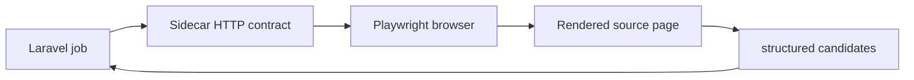

# Sidecar Browser

The Node sidecar exists for pages where static HTTP responses do not expose usable candidate images or structured product data.

## Use It When

::: steps
1. A source loads product galleries client-side.
2. JSON-LD or meta tags appear only after rendering.
3. The host app can isolate browser work from PHP workers.
:::

## Avoid It When

Static provider results already include stable image URLs, dimensions, and source pages. Browser rendering adds latency and operational cost.
