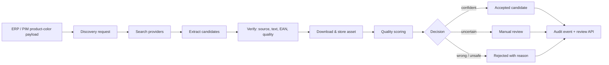

# product_image_discovery


[](https://packagist.org/packages/padosoft/product-image-discovery)


[](https://github.com/padosoft/product_image_discovery)


> **product_image_discovery finds the *right* product image, not just any image.**
> It turns an ERP/PIM product-color identity into a verified, scored, downloaded image — through a
> conservative pipeline that searches providers, extracts candidates, checks brand/model/color/EAN,
> rejects wrong-variant matches and holds anything uncertain for human review. Self-hosted, queue-ready,
> deterministic-first, AI-optional.

::: callout info "New here? Read this page top to bottom" icon:compass
In five minutes you'll know exactly what this package is, the expensive problem it solves, why it beats
"just run an image search", and where to click next. Every other page goes deeper — this one gives you
the whole picture.
:::

---

## What it is — in one minute

Sourcing product images at catalog scale has one expensive failure mode: it is not "we found no image",
it is **publishing the wrong image for a product-color variant** — the white sneaker on the black SKU,
last season's jacket on this season's code. Generic image search is optimized to *always return
something*; a catalog needs the opposite — return the *correct* image or return nothing.

`padosoft/product-image-discovery` is a Laravel package built around that principle. Given a product
identity keyed on `client_id + erp_model_color_id`, it runs a **conservative, multi-stage pipeline**:

- **Discover** — generate targeted queries from brand, model, SKU, supplier SKU, EAN and color, then
  search configurable providers (Brave, Tavily, Exa, Firecrawl, SearchAPI, and more).
- **Verify** — extract candidates from results, structured data, Open Graph and gallery markup, then
  score each one on source trust, text identity, structured GTIN/EAN and hard rejection reasons.
- **Decide** — strong matches advance, uncertain ones go to **manual review**, wrong-color / wrong-model
  / unsafe ones are rejected with a reason — every decision audited.

> **In one line:** *the conservative image-sourcing brick for catalogs — discover, verify, score and
> download the correct product-color image, with human review where confidence is not enough.*

---

## The problem it solves

Every catalog, PIM and marketplace team hits the same wall: you can find *an* image instantly, but
finding the *right* one — and proving it's right — is the hard, expensive part. Here is the gap this
package closes.

| Without product_image_discovery | With product_image_discovery |
|---|---|
| Generic image search returns *something* for every query, including the wrong color or model. | A conservative pipeline optimizes for **low false positives** — it returns evidence, or nothing. |
| A wrong-variant image ships to production and a customer receives the wrong product. | Identity is keyed on `client_id + erp_model_color_id`; wrong-color / wrong-model candidates are hard-rejected with a reason. |
| Sourcing is a manual, untraceable copy-paste from supplier sites. | An API ingests ERP/PIM payloads and runs an auditable **search → extract → verify → download → score** flow. |
| You can't tell *why* an image was chosen or rejected. | Every candidate carries source, score components, quality signals and audit events — explainable decisions. |
| One-off scrapers break the moment a provider or a JS-heavy page changes. | Providers are database-configured and swappable; an optional **Playwright sidecar** handles JS-rendered pages. |
| "Just add AI" makes the core fragile and non-deterministic. | Deterministic checks run **first and always**; AI/vision is opt-in enrichment, never the publication gate. |
| EAN/barcode is ignored even when your feed has it. | EAN/GTIN aliases are normalized and used as a **strong identity signal** — without overriding visible contradictions. |

---

## Who it's for

::: grids
  ::: grid
    ::: card "Ecommerce & catalog teams" icon:shopping-cart
    You publish thousands of product-color variants and cannot afford the wrong image on a SKU. Get a verified candidate or a clear "needs review" — never a silent wrong match.
    :::
  :::
  ::: grid
    ::: card "Marketplaces" icon:store
    Onboard supplier feeds at scale where image correctness per variant is a trust and returns problem. Conservative scoring keeps bad images out of the listing.
    :::
  :::
  ::: grid
    ::: card "PIM & ERP integrators" icon:database
    Ingest `client_id + erp_model_color_id` payloads over a clean API, resume persisted requests, and pull back reviewable candidates — Laravel-native, queue-ready.
    :::
  :::
  ::: grid
    ::: card "Operations & review teams" icon:user-check
    A manual-review queue with audit events, debug-flow tracing and approve/reject endpoints turns uncertainty into a controlled human workflow.
    :::
  :::
:::

---

## Why it's different — the moats

Most tools either **find** images or **scrape** pages. This package is built to find the *correct*
product-color image and to prove it — conservatively, self-hosted, and explainable.

::: grids
  ::: grid
    ::: card "Conservative by design" icon:shield-check
    The whole pipeline optimizes for **low false positives**. The default stance is to return reviewable evidence before risky automation — wrong is more expensive than empty.
    :::
  :::
  ::: grid
    ::: card "Product-color identity, not just SKU" icon:palette
    Identity is `client_id + erp_model_color_id`. The decision layer rejects wrong-color and wrong-model candidates even when everything else looks plausible.
    :::
  :::
  ::: grid
    ::: card "Explainable, audited decisions" icon:scroll-text
    Every candidate carries source, score components, quality signals and a rejection reason; every decision and retry writes an audit event you can inspect later.
    :::
  :::
  ::: grid
    ::: card "Verification cascade" icon:list-checks
    Source trust → text identity → structured GTIN/EAN → image quality → hard rejection reasons. An exact EAN match still can't override a visibly wrong color or product type.
    :::
  :::
  ::: grid
    ::: card "Manual review as a first-class state" icon:user-check
    Uncertain matches don't get published and don't get dropped — they land in a review queue with approve / reject / retry endpoints and full context.
    :::
  :::
  ::: grid
    ::: card "Provider-ready, swappable" icon:plug
    9 search providers (Brave, Tavily, Exa, Firecrawl, SearchAPI, You.com, WebSearchAPI, DuckDuckGo + a deterministic fake) configured in the DB and resolved through one manager — swapping one is a row update.
    :::
  :::
  ::: grid
    ::: card "Deterministic-first, AI-optional" icon:cpu
    Deterministic source/text/quality checks always run; optional LLM/vision verification (Regolo, Anthropic, OpenAI, OpenRouter) enriches decisions without making the core fragile or offline-hostile.
    :::
  :::
  ::: grid
    ::: card "Browser only when needed" icon:globe
    JS-heavy product pages are handled by an optional Node + Playwright sidecar that stays out of PHP, with a static HTTP+HTML fallback when rendering isn't available.
    :::
  :::
  ::: grid
    ::: card "Debuggable end to end" icon:bug
    A `debug-flow` console command streams the full trace — queries, sites, candidates, score components, AI output, download path, SHA-256 hash and final decision — so you can see exactly why each run landed where it did.
    :::
  :::
:::

---

## See it: the review & operations admin

This package stays **headless**, but a production-grade back office ships separately as
[`padosoft/product_image_discovery_admin`](https://github.com/padosoft/product_image_discovery_admin) —
a Laravel admin with request review queues, candidate comparison, protected image previews,
approve/reject/retry actions, provider and trusted-source configuration, a guided debug-flow runner,
health checks and CSV export. It drives this package's API directly.


---

## product_image_discovery vs. the alternatives

| Capability | **product_image_discovery** | Manual sourcing | Generic image search API | DIY scraper |
|---|:---:|:---:|:---:|:---:|
| Optimizes for low false positives (correct image or none) | ✅ | ➖ | ❌ | ❌ |
| Product-color (`erp_model_color_id`) identity matching | ✅ | ➖ | ❌ | ❌ |
| Hard-rejects wrong color / model / unsafe images | ✅ | ➖ | ❌ | ❌ |
| EAN / GTIN strong-match scoring | ✅ | ❌ | ❌ | ➖ |
| Manual-review queue + audit events | ✅ | ➖ | ❌ | ❌ |
| Swappable multi-provider search (9 drivers) | ✅ | ❌ | ➖ | ❌ |
| Optional AI/vision without losing determinism | ✅ | ❌ | ❌ | ❌ |
| Self-hosted in **your** Laravel DB, you own the data | ✅ | ✅ | ❌ | ✅ |

> Legend: ✅ built-in · ➖ partial / manual / not guaranteed · ❌ not available.

---

## How it fits together

A product identity enters as a discovery request and flows through one conservative pipeline: search,
extract, verify, download and score — ending in an accepted candidate, a manual-review item, or a
reasoned rejection, all audited.



---

## Start in 30 seconds

::: steps
1. **Install the package**
   ```bash
   composer require padosoft/product-image-discovery
   php artisan vendor:publish --tag=product-image-discovery-config
   php artisan vendor:publish --tag=product-image-discovery-migrations
   php artisan migrate
   php artisan db:seed --class="Padosoft\ProductImageDiscovery\Database\Seeders\ProductImageDiscoveryDefaultsSeeder"
   ```

2. **Send a product-color payload to the API**
   ```bash
   curl -X POST "https://your-app.test/api/product-image-discovery/requests" \
     -H "Authorization: Bearer YOUR_TOKEN" \
     -H "Accept: application/json" \
     -H "Content-Type: application/json" \
     -d '{
       "client_id": 10,
       "erp_model_id": "SHOE-123",
       "erp_model_color_id": "SHOE-123-BLACK",
       "brand": "Example Brand",
       "model_code": "SHOE-123",
       "color_name": "Black",
       "category": "Sneakers"
     }'
   # → {"ok":true,"request_id":1,"status":"queued"}
   ```

3. **Review and approve the verified candidate**
   ```bash
   curl "https://your-app.test/api/product-image-discovery/requests/search?status=manual_review" \
     -H "Authorization: Bearer YOUR_TOKEN" -H "Accept: application/json"

   curl -X POST "https://your-app.test/api/product-image-discovery/requests/1/candidates/5/approve" \
     -H "Authorization: Bearer YOUR_TOKEN" -H "Accept: application/json"
   ```
:::

Want the full no-paid-key path? The **[Quickstart](/get-started/quickstart/)** takes a fresh Laravel 13
app to a passing end-to-end request with a bundled deterministic fake provider.

**[→ Quickstart](/get-started/quickstart/)** · **[→ Installation](/get-started/installation/)** · **[→ Pipeline Workflow](/guides/pipeline-workflow/)**

---

## Batteries included for AI-assisted development

This repo ships **AI batteries** — an `AGENTS.md` workflow contract, `.claude/rules/` encoding the
docmd docs-sync discipline, and an invocable `.claude/skills/docmd-docs` skill. Open the package in
Claude Code, Cursor, Copilot or Codex and your agent already knows the house rules.

---

## Where to go next

::: grids
  ::: grid
    ::: card "Quickstart" icon:zap
    From a fresh Laravel 13 app to a passing discovery request — no paid keys. **[Open →](/get-started/quickstart/)**
    :::
  :::
  ::: grid
    ::: card "Concepts & Theory" icon:brain
    Why conservative matching is its own discipline, and the scoring theory behind every decision. **[Read →](/concepts/motivation/)**
    :::
  :::
  ::: grid
    ::: card "Architecture" icon:boxes
    The layered pipeline, data model and the ADRs behind the design. **[Explore →](/architecture/overview/)**
    :::
  :::
:::

::: callout tip "Package facts" icon:info
Composer `padosoft/product-image-discovery` · PHP `^8.3` · Laravel `^13.0` · Apache-2.0 ·
[GitHub](https://github.com/padosoft/product_image_discovery) ·
[Packagist](https://packagist.org/packages/padosoft/product-image-discovery)
:::
