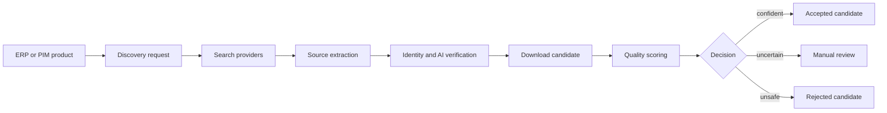

# product_image_discovery

Find the right product image, not just any image.

`padosoft/product-image-discovery` is a Laravel package for conservative product image discovery, verification, scoring, download, and manual review workflows. It is built for catalog teams, ERPs, PIMs, and marketplaces where publishing the wrong model-color image is more expensive than returning no image.

::: callout info
Use this package only for lawful, authorized product image workflows. Respect source terms, robots.txt, rate limits, and supplier agreements.
:::

::: grids
::: grid
**Conservative pipeline**

Search, extract, verify, download, score, and hold uncertain candidates for review.
:::
::: grid
**Laravel native**

Service provider, config, migrations, API controllers, form requests, resources, jobs, and queue names.
:::
::: grid
**Provider-ready**

Search providers are configured in the database and resolved through a manager from `padosoft/laravel-ai-search-providers`.
:::
::: grid
**Audit-friendly**

Requests, candidates, events, settings, providers, and trusted sources are stored for traceability.
:::
::: grid
**Browser optional**

The Playwright sidecar is separate from PHP and used only when pages need rendering.
:::
::: grid
**AI-assisted**

Vision verification can enrich decisions without replacing deterministic safeguards.
:::
:::

::: card
**Default stance**

The package should return reviewable evidence before it returns risky automation.
:::

## Package Facts

| Item | Value |
| --- | --- |
| Composer package | `padosoft/product-image-discovery` |
| PHP | `^8.3` |
| Laravel components | `^13.0` |
| License | `Apache-2.0` |
| Author | Lorenzo Padovani, Padosoft |
| Docs URL | `https://doc.product-image-discovery.padosoft.com` |

## First Reading Path

::: steps
1. Install the package and publish its config and migrations.
2. Run the quickstart with the deterministic fake provider.
3. Read the pipeline workflow to understand how jobs advance.
4. Configure real search providers and trusted sources.
5. Add review and operations practices before enabling automated publishing.
:::

## Core Flow

## Where To Go Next

::: tabs
::: tab Quickstart
Start with [Quickstart](/get-started/quickstart/) for a local, no-paid-key smoke test.
:::
::: tab Architecture
Read [Architecture Overview](/architecture/overview/) for components, boundaries, and job flow.
:::
::: tab API
Use [API Reference](/reference/api/) when wiring ingestion or review tools.
:::
:::
